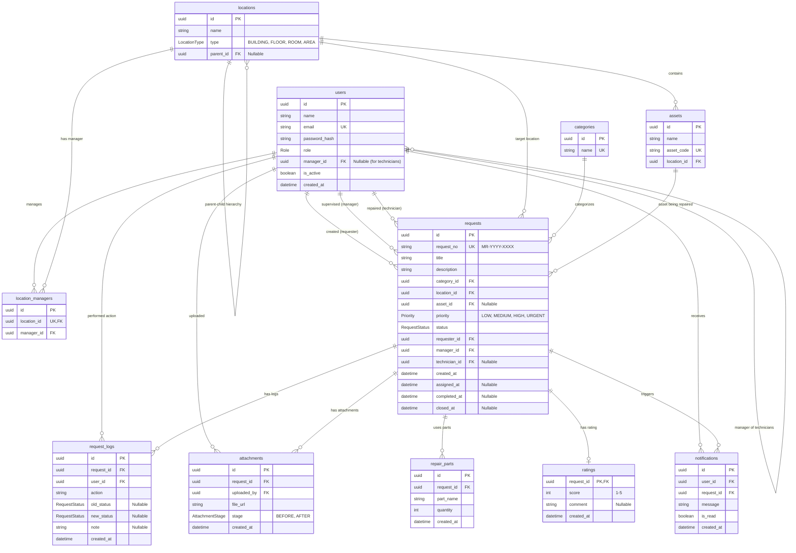

# Fixify Database ER Diagram

```mermaid
erDiagram
    users ||--o{ users : "manager of technicians"
    users ||--o{ location_managers : "manages"
    users ||--o{ requests : "created (requester)"
    users ||--o{ requests : "supervised (manager)"
    users ||--o{ requests : "repaired (technician)"
    users ||--o{ request_logs : "performed action"
    users ||--o{ attachments : "uploaded"
    users ||--o{ notifications : "receives"

    locations ||--o{ locations : "parent-child hierarchy"
    locations ||--o{ location_managers : "has manager"
    locations ||--o{ assets : "contains"
    locations ||--o{ requests : "target location"

    categories ||--o{ requests : "categorizes"
    assets ||--o{ requests : "asset being repaired"

    requests ||--o{ request_logs : "has logs"
    requests ||--o{ attachments : "has attachments"
    requests ||--o{ repair_parts : "uses parts"
    requests ||--o| ratings : "has rating"
    requests ||--o{ notifications : "triggers"

    users {
        uuid id PK
        string name
        string email UK
        string password_hash
        Role role
        uuid manager_id FK "Nullable (for technicians)"
        boolean is_active
        datetime created_at
    }

    locations {
        uuid id PK
        string name
        LocationType type "BUILDING, FLOOR, ROOM, AREA"
        uuid parent_id FK "Nullable"
    }

    location_managers {
        uuid id PK
        uuid location_id UK, FK
        uuid manager_id FK
    }

    categories {
        uuid id PK
        string name UK
    }

    assets {
        uuid id PK
        string name
        string asset_code UK
        uuid location_id FK
    }

    requests {
        uuid id PK
        string request_no UK "MR-YYYY-XXXX"
        string title
        string description
        uuid category_id FK
        uuid location_id FK
        uuid asset_id FK "Nullable"
        Priority priority "LOW, MEDIUM, HIGH, URGENT"
        RequestStatus status
        uuid requester_id FK
        uuid manager_id FK
        uuid technician_id FK "Nullable"
        datetime created_at
        datetime assigned_at "Nullable"
        datetime completed_at "Nullable"
        datetime closed_at "Nullable"
    }

    request_logs {
        uuid id PK
        uuid request_id FK
        uuid user_id FK
        string action
        RequestStatus old_status "Nullable"
        RequestStatus new_status "Nullable"
        string note "Nullable"
        datetime created_at
    }

    attachments {
        uuid id PK
        uuid request_id FK
        uuid uploaded_by FK
        string file_url
        AttachmentStage stage "BEFORE, AFTER"
        datetime created_at
    }

    ratings {
        uuid request_id PK, FK
        int score "1-5"
        string comment "Nullable"
        datetime created_at
    }

    repair_parts {
        uuid id PK
        uuid request_id FK
        string part_name
        int quantity
        datetime created_at
    }

    notifications {
        uuid id PK
        uuid user_id FK
        uuid request_id FK
        string message
        boolean is_read
        datetime created_at
    }
```
